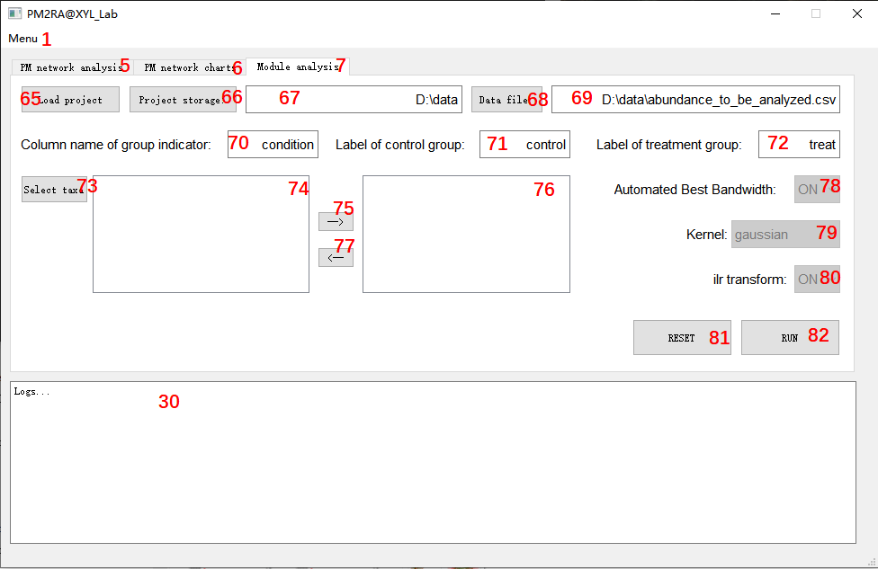
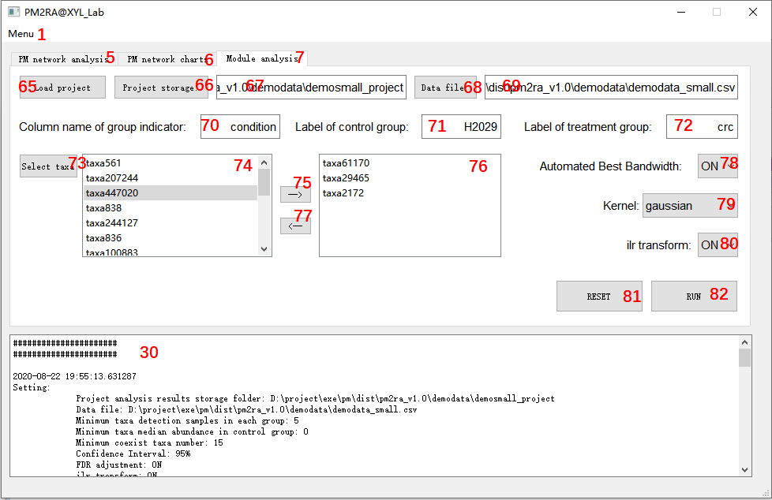

PM2RA@XYL_Lab User Manual

 
==========================
PM2RA@XYL_Lab: Detecting and Quantifying Relationship Alterations in Microbial Community
This manual provides guidance for PM2RA@XYL_Lab. *PM2RA@XYL_Lab* examines the relationship alteration (RA) in the microbiome between groups and can provide additional hints about the pathogenesis of human disease.
 
## Scenario
One has conducted an experiment and measured the microbiome sequences. The microbial abundance table were derived from the sequence data. The changes between groups can be decomposed into two parts. One parts is the taxa changes itself. The other part is the taxa and taxa relationship alternations. Hence one wants to determine the relationship alternations involving two or more microbes ('sub-community') under different conditions. 

## Data preparation
Both absolute abundance data and relative abundance data are accepted. Absolute abundances will be converted to relative abundances by the software before next step analysis. 
Data should be in comma-separated values (CSV) format. Microsoft Office Excel, Apache OpenOffice spreadsheets, Mac Numbers or plain text editor can help to format the data file. Following is the data template. 

Fig 1, datafile format demo
  
 

The corresponding plain text is like fig2.

Fig 2 plain text demo
  
 

The datafile is composed with the group indicator column and taxa abundance data. The rows are samples and the columns are taxa. Do not include the sample id or other metadata in the data file. For taxa not detected in the sample, leave the corresponding cell in the data sheet blank or fill with 0 are both OK. The group labels in one group should be kept consistent. Be careful for the leading and trailing spaces in spreadsheet cells.

To make a qualified analysis, the sample size of each group should be at least 6. Uneven sample sizes are acceptable.
## Getting started: make a PM network analysis
PM2RA provides several functions related to PM analysis and chart plotting. When one gets the abundance data table, PM network analysis is the first step. The Menu functions and setting tips are as follows, fig 3.

Fig 3 PM network analysis configuration
  
 
PM network analysis will traverse and calculate the changes, i.e. the PM scores of all taxa and possible 2-dimensional taxa sub communities between groups. To make this work, one need to specify the required parameters before hit the run button.

> 1.	Click the tab **5** and navigate to *PM network analysis*.
> 2.    Click the *Project storage* button **9**, a file folder selection dialog box will pop up and one can choose the places to store all analysis result. After selection, the input feild **10** will show the user's folder place. User can also directly paste the absolute path of the storage folder on the input feild **10**. Please make sure the fileplace folder do exist in your system. 
> 3.    Click the *Data file* button **11**, a file selection dialog box will pop up and one can choose the datafile to be analyzed. Only csv formated files are acceptable. After selection, the input feild **12** will show the datafile. User can also directly paste the absolute path of the datafile on the input feild **12**. 
> 4.    Set the *minimum taxa detection samples in each group* **13**. If a taxa is only detected in a few samples less than the set value in either the control group or the treatment group, it will be filtered out. The value should be an integer. It is suggested the value is set larger than 6. 
> 5.    Set the *Minimum taxa median abundance in control group* **14**. If the median relative abundance of taxa in the control group is less than the set value, the taxa will be filtered out. This is another way to control the prevalence of taxa. The value should be in [0,1). One can specify this value to 0 if one do not want to filter out low abundance taxa. 
> 6.    Set the *ilr transform* **15** to determine whether performing isometric log-ratio transformation on relative abundance data. Valid values include "ON" and "OFF".
> 7.    Set the *minimum coexist taxa number* **16**. PM2RA analyzes the taxa relationship alternations between groups. Only samples with paired taxa are pipelined into the analysis. Take taxa1 and taxa2 as an example, only taxa1's abundance and taxa2's abundance in a sample are both larger than 0, the sample will be into the analysis. This parameter minimum_coexist_taxa_number specifies the minimum sample size of each group with detected taxa1 and taxa2. The relationship alternation of taxas will not be analyzed if the sample size does not meet this requirement.
> 8.    Set the *confidence level* **17** for statisitical significantly altered relationship identification. Three levels 99%, 95%, 90% are provided.
> 9.    Set the *FDR adjustment* **18** to determine whether turn FDR adjustment on. Benjamini/Hochberg FDR p value adjustment are provided in the software. One can choose turning it on or off. It is suggested if the sample size in each group are larger than 50, the FDR adjust is on. 
> 10.   Set the *Automated best bandwidth* **19** to determine whether turn auto optimization of bandwidth parameter on. The bandwidth is used in kernel density estimation. The larger bandwidth is, the estimated distribution is more smooth. On the other hand, a larger bandwidth will cause information missing. If the autobandwidth is off, the program will use 0.1 as default para. Turnning off this feature alao can save about one-third computing time.
> 11.   Specify the *column name of group indicator* **20**. This should be consistent with the datafile. For the demonstration *demosmall.csv* in fig1, it should be *condition*.
> 12.   Specify the *label of control group* **21**. This should be consistent with the datafile. For the demonstration *demosmall.csv* in fig1, it should be *H2029*.
> 13.   Specify the *label of treatment group* **22**. This should be consistent with the datafile. For the demonstration *demosmall.csv* in fig1, it should be *crc*.
> 14.   Set the Kernel used in the kernel density estimation **23**. 
> 15.   Set wether trun *multithreading*  **24** on.
> 16.   If the multitreading is set ON, Specifiy the *threads* **25** used in the analysis. The number should not exceed the number of logical processors.

After all parameters set, click the RUN **29** button, the software will start PM 1D and 2D analysis. Bar **26** and **27** will show the progresses. Process running logs will be at **30**. One can also click the RESET **28** button, this will restore all input para to default.
PM network analysis will output the analysis result in the project storage specified folder. It includes:
> 1.    The *PM_scores_1D.csv*. This file contains a table listing the 1-dimensional taxa changes (in the column *pm*), the p value of PM(in the column *pvalue*), the q value(FDR adjusted pvalue) (in the column *qvalue*). If FDR adjust is off, q value will be not provided. 1-dimensional pm scores describe the taxa abundance changes between groups.
> 2.    The *PM_scores.csv*. This file contains a table list the 2-dimenesional relationship alternations. The column *taxa1* and *taxa2* specify the corresponding 2 dimenesions. *pm1*, *pvalue1*, *qvalue1* and *pm2*, *pvalue2*, *qvalue2* are *taxa1*'s and *taxa2*'s 1D PM score respectively. The *PM_scores.csv* provides two types of 2-dimenesional PM scores. One is *raw_pm_2d* which brings the changes of taxa1, the changes of taxa2, and the covariance changes of taxa1 and taxa2. The other one is *co_PM_2D*. *co_PM_2D* removes out the effects of the changes of taxa1, the changes of taxa2. The *pvalue* and *qvalue* are corresponding statisitical testing results.
> 3.    The *project.pm*. This is the project file storing all running parameters and logs. One can load provious analyzed project via *load project* **8**.

The PM2RA@XYL_Lab is a cpu-intensive software. It takes about 10 minutes on a laptop computer with I7-8750H using 8 threads to conduct an PM 1D and 2D analysis for an approximately 60 taxa composed relative abundance table. If one have to analysis more taxas, it is recommended to run the scripts on a server PC. It is suggested one conduct a proper prevalence fiter strategy to remove taxa with low abundance or low detection rate before PM2RA analysis. PM2RA@XYL_Lab also provides the built-in prevalence filter. When one get the *PM_scores_1D.csv*, *PM_scores.csv* and *project.pm*, the next step analysis can be started.

## Visualization of PM Network
### 1D PM taxa changes
PM focus on the taxa sub-communities changes between groups. When the dimension of sub-community is reduced to 1, the sub-community becomes the taxa itself. So the 1D PM socres quantifies the taxa changes between groups. PM2RA provides the Visualization of taxa abundance and the 1D PM changes. The software configuration interface is shown in fig 4.

Fig 4 1D PM taxa changes
  
 

> 1.	Click the tab **6** and navigate to *PM network charts*. 
> 2.    Click the *browser* **32** button, load the project to be analyzed. Users have to finish the PM network analysis before Visualization.After selection, the input feild **31** will show the project file. User can also directly paste the absolute path of the project file on the input feild **31**. 
> 3.	Click the tab **33** and navigate to *Plot 1D PM taxa differences*.
> 4.    Check the box *Plot the taxa abundance chart* **36** if user wants to visulize the abundance difference between groups.
> 5.    Check the box *Plot the T-squared statisitics* **37** if user wants to visulize the PM changes between groups.
> 6.    Specify the number of taxa to be plotted **38**. PM2RA offers the top N taxa plotting. If user wants to get insight into a certain taxa, it can be made in the *Plot PM within certain taxas* **35** tab.
> 7.    Determine wether filter out non-statistically significant changed taxa at **39**.
> 8.    Choose *the abundance chart type* **40** if the *Plot the taxa abundance chart* is checked. PM2RA provides three types of abundance chart, the density chart, the box chart and the violin chart. Demos is shown in fig 5.
> 9.    Click the *Plot* button **41** .

Fig 5 Three types of abundance charts
  
 

1D PM taxa changes visualization generates the *taxa_difference_between_groups.pdf* at the project folder. Fig 6 makes a demostaration. The header of the image is PM score. The first charts is taxa relative abundance chart between groups. The second chart is isometric log-ratio transformed taxa abundance chart. The third and the fourth charts are the t-squared statisitics based on different group. THe fifth and sixth charts are the corresponding kernel estimated density. PM score is the non-overlapping area of two probability distribution functions. 

Fig 6 Demo of taxa_difference_between_groups 
  
 

### 2D PM network
For sub-community composed of two taxas, PM scores represents the alternations of the sub-community. The alternations between groups can be decomposed into two parts. One part is the taxa changes itself. The other part is the taxa and taxa relationship alternations. The software provides two netwok types *2D PM scores*, *Interaction PM scores*. The *2D PM scores* type network accounts all alternations. The *Interaction PM scores* type only describes the taxa relationship alternations. 2D PM network software configuration interface is shown in fig 7.

Fig 7 2D PM network software configuration 
  
 

> 1.	Click the tab **6** and navigate to *PM network charts*. 
> 2.    Click the *browser* **32** button, load the project to be analyzed. Users have to finish the PM network analysis before Visualization.After selection, the input feild **31** will show the project file. User can also directly paste the absolute path of the project file on the input feild **31**. 
> 3.	Click the tab **34** and navigate to *Plot PM network with top PM scores*.
> 4.    Check the box *Plot the PM network* **42** if user wants to visulize the PM network.
> 5.    Check the box *Plot the taxa abundance chart* **43** if user wants to visulize the abundance difference between groups.
> 6.    Check the box *Plot the T-squared statisitics* **44** if user wants to visulize the PM changes between groups.
> 7.    Specify the number of edges to be plotted **45**. 
> 8.    Specify network types **46**. 
> 9.    Determine wether filter out non-statistically significant changed taxa at **47**.
> 10.   Determine the edge color map at **48**. Determine the node color map at **49**. The provided colormap is shown in fig8.
> 11.   Choose the network layout style at **50**.
> 12.    Click the *Plot* button **51** .

Fig 8 PM network colormap 
  
 

2D PM network visualization generates *PM_network.pdf* and *taxa_relationship_difference_between_groups.pdf*. The *PM_network.pdf* contains the network chart. Figure 9 gives a demostartion. The edge width and vertices size denotes PM score and topological degree, respectively. 

Fig 9 PM network demo 
  
 

The *taxa_relationship_difference_between_groups.pdf* contains the abundance scatter chart and the t-squared charts. The scatter chart can be used to determine how the relationship between taxas changes. For example, the regression coefficient is significantly changed in fig 10.

Fig 10 taxa scatter chart demo 
  
 

### Interested in certain taxas 
If one is interested in certain taxas, the third tab *Plot PM network within certain taxas* provides this function. The software configuration interface is shown in fig 11.

Fig 11 Plot PM network within certain taxas
  
 

> 1.	Click the tab **6** and navigate to *PM network charts*. 
> 2.    Click the *browser* **32** button, load the project to be analyzed. Users have to finish the PM network analysis before Visualization.After selection, the input feild **31** will show the project file. User can also directly paste the absolute path of the project file on the input feild **31**. 
> 3.	Click the tab **35** and navigate to *Plot PM network within certain taxas*. If the project file is correct, the software will refresh and show the taxa list in the left listwidget as shown in fig 12.

Fig 12 Plot PM network within certain taxas
  
 

> 4.    Using *->* **56** and *<-* **57** to specify the interested taxas. 
> 5.    Check the box *Plot the PM network* **52** if user wants to visulize the PM network.
> 6.    Check the box *Plot the taxa abundance chart* **53** if user wants to visulize the abundance difference between groups.
> 7.    Check the box *Plot the T-squared statisitics* **54** if user wants to visulize the PM changes between groups.
> 8.    Determine the edge color map at **59**. Determine the node color map at **60**. 
> 9.    Specify network types **61**. 
> 10.   Choose the network layout style at **62**.
> 11.    Determine wether filter out non-statistically significant changed taxa at **63**. Note that if a taxa is not significantly changed, it will be skipped. If One want to show all taxa, turn this feature off.
> 12.    Click the *Plot* button **64** .

The software will generate two files, *PM_network_withintaxa.pdf*, *taxa_relationship_difference_between_groups_withintaxa.pdf* or *taxa_difference_between_groups_withintaxa.pdf* depending on how many taxa are selected.

## Module PM analysis

Besides the 1D and 2D PM analysis, PM2RA also can do module PM scores calculation.  The module refers to a sub-community composed with more than 2 taxas. The software configuration interface is shown in fig 13.

Fig 13 PM module analysis configuration
  
 

> 1.	Click the tab **7** and navigate to *Module analysis*.
> 2.    Click the *Project storage* button **66**, a file folder selection dialog box will pop up and one can choose the places to store all analysis result. After selection, the input feild **67** will show the user's folder place. User can also directly paste the absolute path of the storage folder on the input feild **67**. Please make sure the fileplace folder do exist in your system. 
> 3.    Click the *Data file* button **68**, a file selection dialog box will pop up and one can choose the datafile to be analyzed. Only csv formated files are acceptable. After selection, the input feild **69** will show the datafile. User can also directly paste the absolute path of the datafile on the input feild **69**. 
> 4.    Specify the *column name of group indicator* **70**. This should be consistent with the datafile. For the demonstration *demosmall.csv* in fig1, it should be *condition*.
> 5.    Specify the *label of control group* **71**. This should be consistent with the datafile. For the demonstration *demosmall.csv* in fig1, it should be *H2029*.
> 6.    Specify the *label of treatment group* **72**. This should be consistent with the datafile. For the demonstration *demosmall.csv* in fig1, it should be *crc*.
> 7.    Click the *select taxa* button **73**, the software will refresh and show the taxa list in the left listwidget as shown in fig 14.

Fig 14 PM module analysis configuration
  
 

> 8.    Using *->* **75** and *<-* **76** to specify the interested taxas. 
> 9.    Set the *Wether find best bandwidth* **78** to determine whether turn auto optimization of bandwidth parameter on. The bandwidth is used in kernel density estimation. The larger bandwidth is, the estimated distribution is more smooth. On the other hand, a larger bandwidth will cause information missing. If the autobandwidth is off, the program will use 0.1 as default para. 
> 10.   Set the Kernel used in the kernel density estimation **79**. 
> 11.   Set the *ilr transform* **80** to determine whether performing isometric log-ratio transformation on relative abundance data. Valid values include "ON" and "OFF".
> 12.   click the RUN **82** button, the software will start PM 1D and 2D analysis. Process running logs will be at **30**. One can also click the RESET **81** button, this will restore all input para to default.
> 13.   If one has finished the PM 1D and PM 2D analysis, one can load provious analyzed project via *load project* **65**. In this case, all parameters will be consistent with provious setting.

PM module analysis will generate *module_difference_between_groups.pdf* in the project folder. If only one taxa is selected, the density chart will be plotted to show its changes among groups. If two taxa are selected, the scatter chart will be plotted. If the module is composed of more than 2 taxa, a PCoA analysis is conducted and the PCoA chart will be generated shown in fig 15. 

Fig 15 Demo for PCoA chart in moduel analysis
  
 
